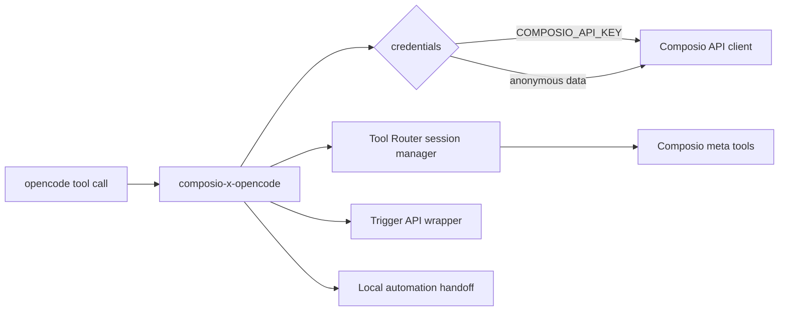

# composio-x-opencode

`composio-x-opencode` is an opencode plugin that exposes a fixed Composio tool namespace for runtime tool discovery/execution, trigger authoring, authentication, diagnostics, and Pi-compatible automation handoff.

The plugin keeps opencode startup predictable by registering 17 stable tools instead of generating thousands of app-specific tools. Runtime behavior is backed by Composio v3.1 Tool Router sessions and trigger endpoints.

## Install

```bash
bun install
bun run build
```

Use the local opencode config from this repo:

```jsonc
{
  "$schema": "https://opencode.ai/config.json",
  "plugin": ["./dist/index.js"]
}
```

Optional slash command setup:

```bash
mkdir -p .opencode/commands
cp examples/commands/composio-claim.md .opencode/commands/composio-claim.md
```

## Configure

`COMPOSIO_API_KEY` is the preferred runtime credential for CI and power users. For first-run local usage, call `composio_signup`; it persists anonymous credentials to `~/.composio/anonymous_user_data.json`, then runtime tools can reuse that key.

| Variable | Default | Purpose |
|---|---|---|
| `COMPOSIO_API_KEY` | none | Composio API key used for Tool Router and trigger APIs |
| `COMPOSIO_USER_ID` | anonymous slug or opencode session | Stable Composio user ID for Tool Router sessions |
| `COMPOSIO_API_BASE_URL` | `https://backend.composio.dev/api/v3.1` | Override for Composio API requests |
| `COMPOSIO_AGENT_BASE_URL` | `https://agents.composio.dev` | Override for anonymous signup and claim |

## Test

```bash
rtk test bun run typecheck
rtk test bun test test/unit --timeout 60000
rtk test bun run build
rtk test bun run smoke:local
rtk test bun run test:integration
rtk test bun run pack:check
```

Optional live runtime smoke:

```bash
COMPOSIO_API_KEY=ak_... rtk test bun run test:live:runtime
```

Optional live anonymous signup contract:

```bash
rtk test env RUN_COMPOSIO_LIVE_AGENT_TESTS=1 bun test test/integration/live-agent-signup.test.ts --timeout 60000
```

## Tools

| Tool | Status | Notes |
|---|---|---|
| `composio_debug_info` | Implemented | Local redacted diagnostics, no network |
| `composio_signup` | Implemented | Anonymous agent signup and local credential persistence |
| `composio_claim` | Implemented | Email claim handoff for anonymous identity |
| `composio_search_tools` | Implemented | Uses Tool Router `COMPOSIO_SEARCH_TOOLS` |
| `composio_get_tool_schemas` | Implemented | Uses Tool Router `COMPOSIO_GET_TOOL_SCHEMAS` |
| `composio_manage_connections` | Implemented | Uses Tool Router `COMPOSIO_MANAGE_CONNECTIONS` |
| `composio_multi_execute_tool` | Implemented | Uses Tool Router `COMPOSIO_MULTI_EXECUTE_TOOL` |
| `composio_remote_bash_tool` | Implemented | Requires `confirm_remote_execution=true` |
| `composio_remote_workbench` | Implemented | Requires `confirm_remote_execution=true` |
| `composio_list_trigger_types` | Implemented | Calls Composio trigger type API |
| `composio_get_trigger_type_schema` | Implemented | Calls Composio trigger type schema API |
| `composio_create_trigger` | Implemented | Requires `confirm_create=true` |
| `composio_list_triggers` | Implemented | Calls Composio active trigger API |
| `composio_enable_trigger` | Implemented | Requires `confirm_enable=true` |
| `composio_disable_trigger` | Implemented | Requires `confirm_disable=true` |
| `composio_delete_trigger` | Implemented | Requires `confirm_delete=true` |
| `save_automation_definition` | Implemented | Saves local JSON artifact under `~/.composio/opencode/automations` |

## Flow



## Stable Namespace

All public tools are lowercase and `composio_`-prefixed except `save_automation_definition`, which intentionally preserves the Pi-compatible automation handoff name.

`save_automation_definition` is the only unprefixed public tool name in v1. Do not rename it; the name is part of the compatibility contract with the Pi automation handoff path.
